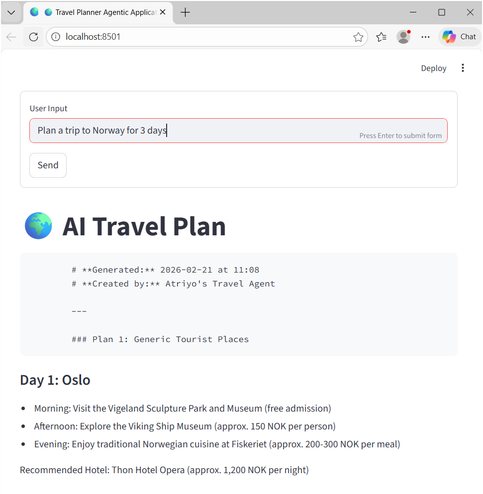
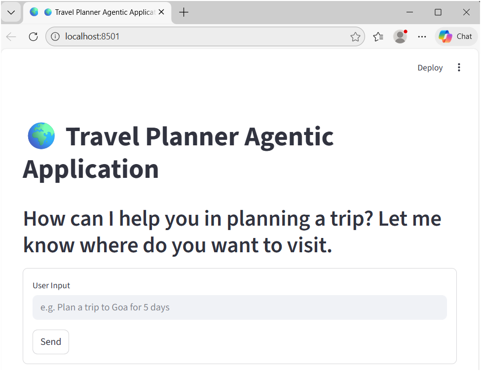

# AI Trip Planner
An AI-powered trip planning application that helps users generate travel itineraries using an agentic workflow.  
The project is built with a **Streamlit frontend** and a **FastAPI backend**, where the UI sends user queries to the API and receives structured travel plans in response.

---

## Problem Statement
Travel planning requires manually cross-referencing weather, local attractions, exchange rates, and route logistics. This project automates that "research loop" by creating an autonomous agent that can browse the live web, access specialized location APIs, and reason through constraints to deliver a structured itinerary.

---

## Tech Stack & Architecture
- **Orchestration** - LangGraph for managing the agent's state and decision-making cycles.
- **Streamlit** – Frontend UI
- **FastAPI** – Backend API

---

## Run the Web App

User enters a query in the Streamlit UI (e.g., “Plan a trip to Goa for 5 days”).

---

## Results
Streamlit sends the request to the FastAPI backend. The backend runs the agentic workflow to generate a plan. The response is sent back to Streamlit and displayed to the user.

